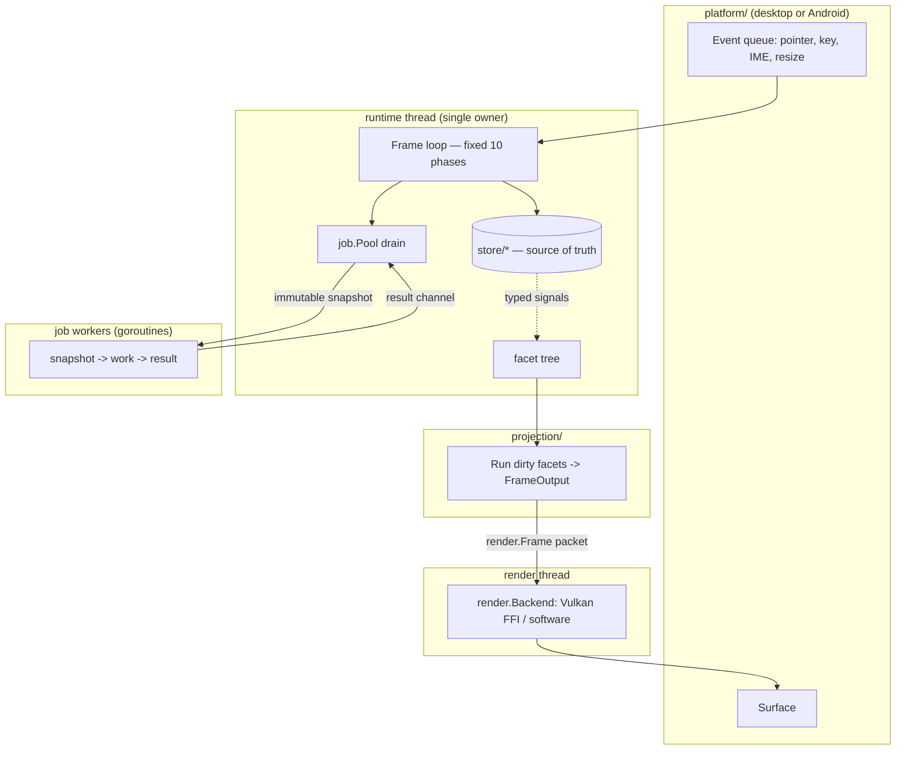
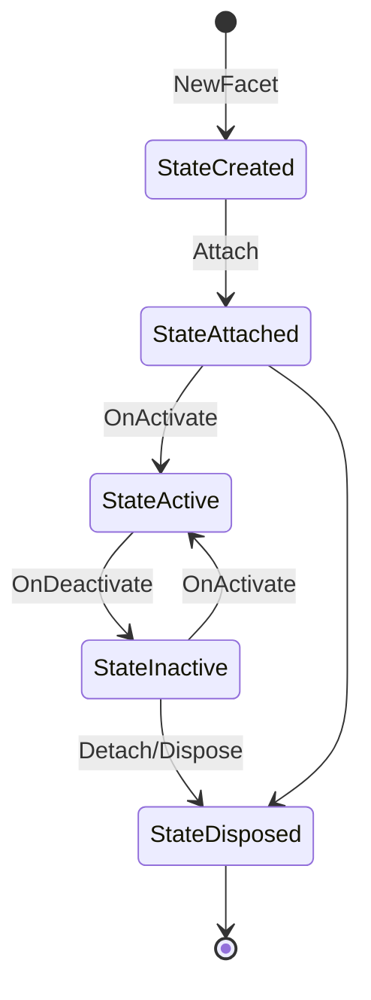
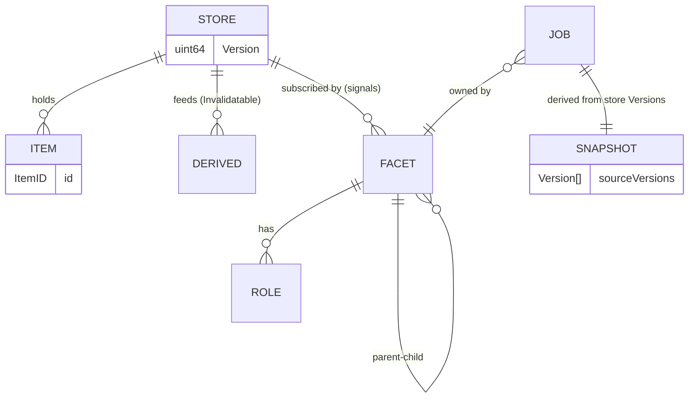

# Developer Documentation — lurpicUI

> Generated from a source-code analysis of the repository at `codeburg.org/lexbit/lurpicui`
> (Go module `go.mod`, `go 1.25.0`). Where the code does not show something, this guide
> says so explicitly rather than guessing. Existing design docs under `Documentation/`,
> `devdocs/`, and `.codex/` are treated as *intended design* and reconciled against the
> actual source where they diverge.

---

## ⚠️ Project Maturity & Who This Is For (read first)

lurpicUI is **pre-1.0** (`lurpiclint` reports `0.1.0-dev`; no release/versioning scheme).
Its two layers have very different readiness:

- **Engine — usable now.** `facet`, `runtime`, `store`, `signal`, `job`, `projection`,
  `layout`, `gfx`, `render` (software + Vulkan), `text`, `assets`. Well-tested, internally
  coherent, contract-enforced by `lurpiclint`. You can build directly on these today.
- **Marks (component library) — BETA, not yet validated.** `marks/*` is mid-rewrite (PRM).
  Its correctness is **gated on a single artifact that does not exist yet**: the
  **Lurpic Studio** showcase app (`devdocs/plans/lurpic-studio-demo.md`), a 48-mark,
  16-phase catalogue whose explicit job is to prove every mark *renders and reacts* to a
  human. Until that app is built and green (its §10 test hygiene + §12 Definition of Done
  are the readiness signal), treat the marks API as **subject to change** and the marks
  documentation (`Documentation/marks.md` and older files) as aspirational.

**Why the marks gate exists:** golden/conformance tests prove "this mark produced these
bytes," not "clicking it mutates state and the dependent mark re-projects." Only the
catalogue's interaction tests + manual-QA checklist (Coverage Matrix, §6 of the spec) close
that gap. Known open contract issues are tracked in the spec's §13 (e.g. **R1 constructor
asymmetry** — some marks take `Binding[T]`, others plain config).

**So, who is this guide for *today*?**
- ✅ **Framework contributors & evaluators** — full guide applies.
- ✅ **App authors building on the engine** (custom facets + roles + stores + jobs) — §10
  How-To 1 and How-To 3 are verified and safe to follow.
- ⏳ **App authors who want the widget library** — wait for Lurpic Studio to ship. The
  validated, copy-from-real-code marks usage will land with it; until then §10 How-To 2 is
  a *spec-derived sketch*, not verified usage.

---

## 1. Executive Summary

**What it is.** lurpicUI is a from-scratch, GPU-accelerated **UI framework written in Go**.
It calls itself a *"Facet Projection UX framework"* (`README.md`). It is not a binding to an
existing toolkit (GTK/Qt/web): it owns its own retained scene model (the *facet tree*), its
own layout engine (`layout/`), its own command-based 2-D graphics IR (`gfx/`), its own
renderer (a Vulkan backend implemented in **Rust** under `render/vulkan/`, plus a pure-Go
**software** fallback under `render/software/`), text shaping (`text/` on top of
`go-text/typesetting`), an asset pipeline (`assets/`), and a component library (`marks/`).

**What problem it solves.** It provides a single programming model for building native
desktop and **Android** applications with a data-driven, retained-mode UI. The central bet:
application state lives in **stores**; UI elements (*facets*) are pure *projections* of that
state; one **runtime thread** owns all mutable state and runs a fixed-order frame pipeline.
This is meant to make rendering deterministic, debuggable, and free of the data-race classes
common in imperative UI toolkits.

**Who consumes it.**
- **App authors** who write a `main.go` using the `app` package + `marks` components (see
  `demos/quick_square_app/`).
- **Component/“mark” authors** who build reusable widgets against the `marks.Mark` contract.
- **Framework engineers** maintaining the runtime, layout, render, and asset subsystems.
- The **`lurpic` CLI** (`cmd/lurpic/`) is the build/run tool consumers use for Android.

**The five things to understand first.**
1. **The facet tree is not the source of truth — stores are.** Read
   `Documentation/Principles/LurpicUI-FacetRuntime-Principles.md` Principles 1, 2, and 8
   before writing any feature.
2. **One thread owns everything mutable** (Principle 4). Background work goes through the
   `job` package as snapshot → work → commit. No goroutines or channels in facet code
   (enforced by lint rule **LL011**).
3. **The frame pipeline has a fixed, 10-phase order** (Principle 9). Invalidations
   *accumulate* and are batched; they do not cascade.
4. **Facets gain behavior by attaching *roles***, not by inheritance (Principle 6):
   `LayoutRole`, `RenderRole`, `HitRole`, `InputRole`, `FocusRole`, `TickRole`, etc.
5. **There is a custom linter, `lurpiclint`**, that enforces architectural contracts. It is
   part of "done"; CI runs it. Read `.codex/lurpiclint.md`.

**Biggest conceptual gotchas.**
- *Projection ≠ rendering* (Principle 3). "Projection" is the whole act of turning state
  into the structures the engine consumes (draw commands, hit regions, layout output);
  rendering is only the final GPU submission. The `projection/` package and the rendering
  backend are deliberately separate, and **facet/projection code may not import `render`**
  (lint **LL010**).
- *Roles are capabilities, not types.* A `nil` role means "capability not registered" and is
  treated as a no-op (see `RenderRole.Collect`/`HitRole.HitTest` in `facet/roles.go`).
- *Two asset paths exist*: bootstrap (startup-only) and the runtime streaming manager
  (`README.md` Developer Notes; `assets/manager.go`).
- *Marks went through a hard rewrite (“PRM”).* `Documentation/marks.md` is the
  current shape reference and supersedes `marks-animation-theme-api.md` and
  `artist-authoring-model.md`; older docs are stale.

---

## 2. High-Level Architecture

### Architectural style

A **modular monolith / layered engine** with a strict, one-directional dependency rule and a
**role/plugin model** at the facet layer. It resembles a game-engine architecture more than a
web stack: a single authoritative simulation thread (the *runtime thread*) driving a
fixed-order frame loop, with worker threads and a render thread fed only via immutable
snapshots/packets.

Cross-cutting design constraints (from `Documentation/Principles/…Principles.md`):
- **Principle 4** — the runtime thread exclusively owns the facet tree, stores, signals,
  interaction state, and projection results.
- **Principle 9** — fixed phase order per frame.
- **Principle 10** — interfaces at every seam that will vary (render backend, platform,
  asset source, layer policy).

### Major layers / components

| Layer | Packages | Responsibility |
|---|---|---|
| **App entry** | `app/`, `cmd/lurpic/` | `app.Run` wires platform + window + backend + runtime; CLI builds/runs (esp. Android). |
| **Runtime** | `runtime/` | Owns the frame loop, job pool, command registry, asset manager wiring, window frames. |
| **Facet model** | `facet/` | The retained tree, roles, lifecycle, focus, hit transforms. |
| **State** | `store/`, `signal/`, `job/` | Source-of-truth stores, typed signals, structured snapshot/commit concurrency. |
| **Projection** | `projection/`, `marks/`, `scale/`, `graph/` | Turn state → layout-ready + draw structures; component library; data-viz scales. |
| **Layout** | `layout/` (+ `linear`, `grid`, `anchor`, `split`, `stack`, `radial`, `free`, `space`) | Constraint-based measure/arrange; the **layer model**. |
| **Graphics IR** | `gfx/` | Command list (`FillRect`, brushes, etc.), geometry types (`Rect`, `Point`, `Color`). |
| **Render** | `render/`, `render/vulkan/` (Rust), `render/software/` | Backend interface + Vulkan (FFI) and software rasterizer implementations. |
| **Text** | `text/` | Font registry, shaping, layout (`go-text/typesetting`, `go-text/render`). |
| **Theme** | `theme/` | Tokens, resolver, materials, recipes per component family. |
| **Assets** | `assets/` (+ `cook`, `schema`, `pak`/`pakfs`) | Cooking, packing (flatbuffers schemas), streaming, caching, texture upload. |
| **Platform** | `platform/`, `platform/android/` | Windowing, event queue, input/IME, audio; desktop vs. Android. |
| **Input** | `input/` | Gesture/hover/focus state machine feeding the runtime. |
| **Tooling** | `cmd/lurpiclint/`, `scripts/`, `diagnostics/` | Custom linter, validation scripts, diagnostics. |

### Data flow (input → output)



The render thread communicates back to the runtime thread **only** through a fatal-error
channel; workers communicate back **only** through the job result channel drained once per
frame (Principle 4).

### Intentional vs. accidental

- **Intentional:** the store/facet/projection split, the role model, the layer model, the
  custom linter, the Rust Vulkan FFI boundary, the marks rewrite (PRM).
- **In-progress / transitional (evidence):** `demos/lurpic_studio/` is an empty directory;
  `Documentation/marks.md` carries a BETA / Studio-gated maturity banner; the memory index
  notes open marks-golden defects and test-rigor gaps. Treat marks variant coverage and the
  studio demo as unfinished.

---

## 3. Repository Map

| Path | Purpose | Important Notes |
|---|---|---|
| `app/` | Application bootstrap. `app.Run(Config, RootBuilder)` is the public entry. | `app/run.go`, `app/config.go`, `app/crash.go`. Desktop vs. Android via build tags (`run_android.go`, `assets_android.go`). |
| `cmd/lurpic/` | The `lurpic` build/run CLI (Android-focused). | `main.go`, Android builder + `doctor`, `validate`, `clean`. Resolves config per *Configuration Hierarchy*. |
| `cmd/lurpiclint/` | Custom static analyzer enforcing framework contracts. | Subcommands `check`, `capabilities`, `explain`. Rules LL001–LL015. Internal: `rules`, `classify`, `capindex`, `loader`, `config`, `diag`. |
| `cmd/lurpiclint/main.go` lint | second CLI binary `lurpiclint`. | Note two lint entrypoints exist (`cmd/lurpiclint` and root `cmd/lurpiclint/main.go`); see §16/§18. |
| `facet/` | The retained UI node (`Facet`) + roles + lifecycle + focus. | `facet.go`, `roles.go`, `role.go`, `transition.go`, `lifecycle.go`, `context.go`, `focus.go`. Modify when adding capabilities. |
| `runtime/` | Frame loop, scheduling, command registry, asset/render wiring. | `core.go` (`New`, `Schedule`, frame assembly), `config.go` (`Config`, `FrameTimer`), `control.go`, `commands.go`. |
| `store/` | Source-of-truth state containers. | `CollectionStore[T]`, `Derived[T]`, `Transaction`, `Version`. Generics-heavy. |
| `signal/` | Typed pub/sub + subscription lifetimes. | `Signal[T]`, `Subscriptions`, `Track`. |
| `job/` | Structured snapshot→work→commit concurrency. | `Pool`, `Job[I,O]`, `Snapshot[T]`, `CancelToken`, `BindJob`. The only sanctioned concurrency. |
| `projection/` | Drives layout+projection over dirty facets → `FrameOutput`. | `projection.go` (`System`, `Run`, `HitMap`). |
| `layout/` | Constraint layout + the **layer model**. | `layer*.go`, plus policy subpkgs `linear`, `grid`, `anchor`, `split`, `stack`, `radial`, `free`, `space`. |
| `gfx/` | 2-D command IR and geometry. | `CommandList`, `FillRect`, `SolidBrush`, `Rect`, `Point`, `Color`, `Size`. |
| `render/` | Backend interface + frame packets + upload queue. | `render.Backend`, `render.Frame`, `render.Surface`, `UploadQueue`. |
| `render/vulkan/` | **Rust** Vulkan backend via FFI. | Crate `crates/lurpic_render`; see `CONVENTIONS.md` (FFI result codes, opaque handles, panic catching). Built via CMake/Cargo. |
| `render/software/` | Pure-Go fallback rasterizer. | Default for headless/CI/Android-without-Vulkan. |
| `text/` | Fonts, shaping, layout. | `FontRegistry`, `FontSource`. Built on vendored `go-text`. |
| `theme/` | Design tokens → resolved styles/materials. | `context.go`, `resolver.go`, `tokens.go`, `material.go`, `recipes/` per family. |
| `marks/` | Component library (the widgets). | Families: `primitive`, `action`, `input`, `selection`, `navigation`, `feedback`, `status`, `structure`, `viz`, `data`. Contract in `Documentation/marks.md`. |
| `scale/` | Data-viz scales (linear/etc.), pan/zoom. | float64 internal / float32 boundary; store-backed. Used by `marks/viz`. |
| `graph/` | Scene/graph index + canvas helpers. | `graph/index`, `graph/canvas`. |
| `assets/` | Asset cooking, packing, streaming, caching, upload. | `manager.go`, `cook/`, `schema/` (flatbuffers: `cfnt`, `csg`, …), `pak`/`pakfs`, `static-default/` (bundled icons/fonts). |
| `platform/` | Windowing/events/input/audio. | `platform/android/` (bridge, audio) is build-tagged. |
| `input/` | Gesture/hover/focus state machine. | `input.go` (`System`, `GestureConfig`). |
| `animation/`, `signal/`, `job/` | Animation + reactive plumbing. | |
| `demos/` | Example apps. | `quick_square_app/` (working minimal app); `lurpic_studio/` (empty — placeholder). |
| `Documentation/`, `devdocs/` | Design docs + plans. | `Documentation/` = intended-design references; `devdocs/plans/` = specs (some under `done/`). |
| `internal/` | Shared internal helpers. | `testkit`, `syncutil`, `renderutil`, etc. Not importable outside module. |
| `CMakeLists.txt`, `CMakePresets.json`, `cmake/`, `build/` | Native build orchestration (Rust + Go). | CMake drives the Rust crate + packaging. |
| `.github/workflows/` | CI (`Android CI`). | Go 1.24 on CI (note: `go.mod` says 1.25.0), Rust toolchain, Android SDK/NDK. |
| `.golangci.yaml` | Standard Go lint config (separate from lurpiclint). | |
| `lurpic` (binary, ~7.7 MB) | Checked-in prebuilt CLI. | Generated artifact; rebuild with `go build ./cmd/lurpic`. |
| `vendor/` | Vendored Go deps. | `go-text`, `BurntSushi/toml`, `fsnotify`, `flatbuffers`, `klauspost/compress`, `lz4`, `goleak`, `srwiley` SVG. |

**Naming conventions observed:** `*_test.go` for tests; `*_android.go` + build tags for the
Android path; `OnX` for role callbacks; `*Role` for capabilities; `*Store`/`Derived` for
state; `Tx`-suffixed methods for transactional store ops; `marks/<family>/<mark>` layout.

---

## 4. Core Concepts and Domain Model

### Facet
**Plain English.** A node in the retained UI tree. By itself it is just structure + identity;
behavior comes from attached *roles*. **Implemented in** `facet/facet.go` (`type Facet`,
`NewFacet`) and the `FacetImpl` interface (`facet/transition.go`):

```go
type FacetImpl interface {
    Base() *Facet
    OnAttach(ctx AttachContext)
    OnDetach()
    OnActivate()
    OnDeactivate()
}
```

Every concrete widget embeds a `facet.Facet` and returns `&f` from `Base()`. Identity is a
`FacetID` (`facet/id.go`, `uint64`). **Invariant:** a facet's behavior is determined by its
roles, never by its Go type (Principle 6; do not type-switch on facets).

### Role
**Plain English.** A capability plugged into a facet. The frame pipeline calls *roles*, not
facets (Principle 6). Roles live in `facet/roles.go`, `facet/role.go`, `facet/layout_role.go`:

| Role | Key callback(s) | Pipeline phase |
|---|---|---|
| `LayoutRole` | `OnMeasure`, `OnArrange` | Layout (phase 7) |
| `RenderRole` | `OnCollect(list, bounds)` | Projection/assembly (8–9) |
| `HitRole` | `OnHitTest(p) HitResult` | Hit testing |
| `InputRole` | pointer/key delivery | Input (phase 5) |
| `FocusRole` | focus participation | — |
| `TickRole` | per-frame tick | Tick (phase 4) |
| `ViewportRole`, `ProjectionRole`, `TextRole` | viewport transform, projection, text | various |

A `nil` role pointer is a registered-capability check: methods like `RenderRole.Collect`
return `nil`/no-op when the receiver is `nil`. Attach with `Facet.AddRole(r Role)`.

### Store (single source of truth)
**Plain English.** All *shared* observable state. Mutated **only** on the runtime thread;
carries a monotonic `Version` (Principle 2). **Implemented in** `store/`:
- `CollectionStore[T]` (`store/collection.go`) — keyed collection with `Insert/Remove/Update/
  Replace` (+ `…Tx` transactional variants) and subscription hooks (`OnInsertSubscribe`, …).
- `Derived[T]` (`store/derived.go`) — memoized computed value over source `Invalidatable`s;
  recomputes only when a source `Version` changed.
- `Transaction` (`store/transaction.go`) — batches mutations (staged commit).

**Invariant:** every mutation increments a version; jobs snapshot versions and validate
before commit. Without versions the snapshot→commit pattern can't detect staleness.

### Signal
**Plain English.** Typed, synchronous pub/sub for notifying subscribers of changes.
`signal/signal.go`: `Signal[T]` with `Subscribe/Unsubscribe/Emit`. Subscription lifetimes are
managed via `signal.Subscriptions` + `signal.Track` so a facet releases all subscriptions on
detach (`Facet.releaseSubscriptions`). **Signals are never fired from goroutines** (Principle 4).

### Job (structured concurrency)
**Plain English.** The only sanctioned way to do slow/async work. Pattern: **snapshot →
work → commit**. `job/`:
- `Snapshot[T]` captures immutable input + the store versions it derived from; `StillValid`
  re-checks versions before commit.
- `Job[I,O]` + `WorkFn[I,O]` run on a `Pool` of workers.
- `BindJob(ownerID, job, onCommit)` ties a result back to the owning facet; stale/cancelled
  results are discarded (`CancelToken`).

### Lifecycle
`facet/lifecycle.go`: `StateCreated → StateAttached → StateActive → StateInactive →
StateDisposed`. Transitions go through `facet.Attach(...)` (`facet/transition.go`), which
walks the tree, fires each role's `onAttach`, then the facet's `OnAttach`. **Invariant:**
transitions are validated; an illegal jump panics (`invalidTransition`).



### DirtyFlags
`facet/lifecycle.go`: bitflags `DirtyLayout | DirtyProjection | DirtyHit` (`DirtyAll`).
`Facet.InvalidateWithSource(flags, source)` records *who* invalidated (Principle 12 —
observability); read back via `LastInvalidatedBy()`. **Invalidations accumulate and are
batched into phases 7–8; they do not recompute immediately** (Principle 9).

### Mark
**Plain English.** A reusable widget. A mark is a `facet.FacetImpl` that also satisfies
`marks.Mark` by embedding `marks.Core` and exposing config as `marks.Binding[T]` (a reference
to truth, not an owned cell). **Implemented across** `marks/<family>/`. Capability flags are
*derived* by `marks.Describe(m)` via interface assertions (`Focusable`, `Accessible`,
`Composite`, `DataBound`, …) — see §6 and `Documentation/marks.md`.

### Layer
**Plain English.** A viewport-wide, globally-ordered compositing surface. Every visual output
belongs to exactly one layer; the runtime owns layer ordering. Layers are *targets*, not tree
nodes (`Documentation/Principles/LURPICUX_V2_FOUNDATION.md` §1; `layout/layer*.go`,
`StandardLayerRegistry()` in `app/run.go`).

### State has four kinds (Principle 8 — easy to misunderstand)
1. **Truth** → stores. 2. **Derived** → `store.Derived`. 3. **Ephemeral interaction**
(is-pressed) → the facet itself. 4. **Engine** (dirty flags, arranged bounds) → owned by the
runtime. Confusing these is the most common design error; the linter targets it (LL012).

---

## 5. Application Flow and Request Lifecycle

### Startup / initialization
**Trigger:** `app.Run(config, builder)` (`app/run.go:142`).

```mermaid
sequenceDiagram
    participant Main as main()
    participant App as app.Run
    participant Plat as platform.App
    participant BK as render.Backend
    participant RT as runtime.Runtime
    participant Root as RootBuilder

    Main->>App: Run(Config, builder)
    App->>App: normalizeConfig
    App->>Plat: newPlatformApp() (or reuse config.PlatformApp)
    alt Desktop
        App->>Plat: NewWindow(WindowOptions)
        Plat-->>App: window + surface + contentScale
    else Android (surfaceProvider)
        App->>Plat: poll/Wait for WindowCreated -> Surface()
    end
    App->>App: loadFontRegistry(config.Fonts)
    App->>BK: initBackend(Render, surface) (Vulkan -> software fallback)
    App->>App: StandardLayerRegistry(); initAssetManager(&rtConfig)
    App->>RT: newRuntime(rtConfig, platform, window, backend, root)
    App->>Root: builder(BuildContext{FontRegistry,WindowSize,ContentScale,Theme})
    App->>RT: primeRuntime(rt); window.Show()
    App->>RT: runRuntime(rt)  (blocks on frame loop)
```

Where it can fail: nil builder; nil surface; window creation; Android surface timeout
(`surfaceWaitTimeout`); backend init (Vulkan failure → software fallback); font registry load;
layer registry build. All return wrapped `error`s with an `app:` prefix.
`LURPIC_RENDER_BACKEND=software|vulkan` overrides `config.Render` at highest precedence.

### Main frame loop (the "request lifecycle")
**Trigger:** the runtime thread, once per frame (vsync-paced via `runtime.FrameTimer`).
**Fixed phase order (Principle 9; implemented in `runtime/core.go` + `projection.System.Run`):**

1. Drain job results (`runtime.Schedule`/job pool) → commit still-valid results.
2. Collect platform events.
3. Tick hover.
4. Tick active facets (`TickRole`).
5. Deliver input events (`input.System`, `InputRole`).
6. Deliver signals (batched).
7. Run layout on dirty subtrees only (`LayoutRole.OnMeasure/OnArrange`).
8. Run projection on dirty facets only (`projection.System.Run` → `FrameOutput`).
9. Assemble render frame (`runtime.assembleFrame` / `assembleWindowFrames` → `render.Frame`,
   `computeDirtyRegions`).
10. Submit to render thread (`render.Backend`).

**Why this order:** each phase consumes the previous phase's output (jobs change hittability
before input; input emits signals; signals invalidate layout; layout feeds projection;
projection feeds assembly). **Debugging:** when a facet reprojects unexpectedly, check
`LastInvalidatedBy()` and the diagnostics hook (Principle 12) to see *which source* set the
dirty flag in *which phase*.

### Background job execution
A facet calls `runtime.Schedule(job.AnyJob)` (`runtime/core.go:374`). The job is built via
`job.BindJob(ownerID, Job[I,O], onCommit)` with a `Snapshot` of inputs + their store
`Version`s. A worker runs `WorkFn`. On phase 1 of a later frame, results are drained;
`Snapshot.StillValid` re-checks versions; valid → `onCommit` runs on the runtime thread; stale
or cancelled → discarded. Cancel via `runtime.CancelJob(id)`.

### Data persistence
There is no database. "Persistence" = in-memory stores (runtime lifetime) + the **asset
pipeline** for content on disk/`.pak` archives (`assets/`). See §8.

### Error handling
Three classes (Principle 11): **programming errors** (contract violations) → panic;
**recoverable conditions** → returned `error`s; **fatal runtime/render errors** → the render
thread's fatal-error channel. `app/crash.go` installs a crash handler (`InstallCrashHandler`,
`WrapMain`) that writes a `CrashReport` with a stack trace.

### Logging / observability
`runtime.Config.Logger` (a `log.Logger`), plus a `DiagnosticsHook` interface
(`runtime/config.go:20`) and asset diagnostics (`runtime/asset_diag.go`:
`LogAssetMount/Extract/Stream/Evict`). Principle 12: the engine is *observable but not magic*
— invalidation sources are named.

---

## 6. Public APIs and Interfaces

This is a library + CLI, **not an HTTP service** — there are no HTTP endpoints, routes, or
GraphQL. The "APIs" are Go packages, the `marks.Mark` contract, the render/platform backend
interfaces, and two CLI binaries.

### `app` package (primary app-author API)
- `app.Run(config Config, builder RootBuilder) error` — boots the engine, blocks on the loop.
- `app.DefaultConfig(title string, w, h int) Config` — sane defaults (Vulkan, resizable).
- `app.Config{Window, Runtime, Fonts, Theme, PlatformApp, Render, OnBackendSelected}`.
- `app.RootBuilder = func(ctx BuildContext) facet.FacetImpl` — you return your root facet.
- `app.BuildContext{FontRegistry, WindowSize, ContentScale, Theme}`.
- `app.Asset(path string) ([]byte, error)` — bootstrap asset read.

### `facet` package (component-author API)
- `facet.NewFacet() Facet`; `Facet.AddRole(Role)`, `AddChild`, `RemoveChild`,
  `InvalidateWithSource(flags, source)`, `Subs()`, role accessors (`LayoutRole()`, …).
- `facet.Attach(impl, ctx)` — lifecycle transition (usually runtime-driven).
- `facet.RuntimeServices` interface (`facet/context.go`) — what facets may ask the runtime for
  (scheduling, focus, stores) **without importing `runtime`** (avoids the LL010 cycle).

### `marks.Mark` contract (widget plugin interface)
A mark must (from `Documentation/marks.md` "Core Pattern"):
- embed `marks.Core` (role wiring + binding subscription + default anchors);
- configure with `marks.Binding[T]` fields (`marks.Const(v)` for literals);
- call `AddBinding(...)` per field, then `RegisterRoles()`;
- provide a single `BuildCommands(ctx facet.ProjectionContext) []gfx.Command` render path;
- return `marks.Descriptor{Family, TypeName}` from `Descriptor()`;
- implement the `FacetImpl` lifecycle by delegating to `Core.OnAttach/OnDetach/…`.

Capabilities are **derived** by `marks.Describe(m)` (no manual flags):
`Focusable`, `ExportsAnchors`, `Accessible`, `HostsChildren` (`Composite`), `HitTestable`,
`DataBound`.

### Backend / platform interfaces (framework-engineer seams, Principle 10)
- `render.Backend` (+ `render.Surface`, `render.Frame`, `render.UploadQueue`) — implement to
  add a renderer. Two impls: `render/vulkan` (Rust FFI), `render/software` (Go).
- `platform.App` / `platform.Window` / event queue — implement to add a platform.
- `assets` backend types (`assets.BackendType`, `PathIDRegistry`, uploader) — asset sources.
- `layout` layer policy + `StandardLayerRegistry()` — add layers/policies.

### CLI: `lurpic` (`cmd/lurpic`)
| Command | Purpose |
|---|---|
| `lurpic build android [--release] [--aab]` | Build APK/AAB. |
| `lurpic run android [--device <serial>] [--emulator] [--force-software]` | Install + launch. |
| `lurpic validate demos` | Run shared marks + demo validation suites. |
| `lurpic doctor android --verbose` | Check SDK/NDK/JDK/emulator toolchain. |
| `lurpic clean` | Remove generated build output. |

Flags: `--project <dir>`, `--abi <abi>`, `--sdk-path/--ndk-path/--jdk-path`. Config precedence:
CLI flags → project `lurpic.toml` → `~/.config/lurpic/config.toml` → env (`ANDROID_HOME`,
`ANDROID_NDK_HOME`, `JAVA_HOME`) → auto-detect.

### CLI: `lurpiclint` (`cmd/lurpiclint`)
`lurpiclint check ./...` (contract enforcement), `lurpiclint capabilities` (capability index),
`lurpiclint explain <rule-id>`. See §12/§16 for the rule set.

### How to extend an interface
Add a renderer: implement `render.Backend` + `render.Surface`; register it in
`app.initBackend` (`app/run.go:293`). Add a widget: follow the `marks.Mark` core pattern.
Add a store-backed feature: create a `store.CollectionStore[T]`/`Derived[T]` and subscribe
facets to it (never pass mutable state parent→child — Principle 7).

---

## 7. Configuration and Environment

There is no single env-driven config object; configuration is **code** (`app.Config` /
`runtime.Config`) plus the `lurpic.toml` project file for the CLI and a few env overrides.

### `lurpic.toml` (project file, parsed by the CLI)
Required at project root to ship an app (`README.md` "Building An App"). Example
(`demos/quick_square_app/lurpic.toml`) — fields cover app identity + Android packaging
settings (package id, icon set, ABIs). *The full schema is not exhaustively documented in
`Documentation/`; read the loader under `cmd/lurpic/` for the authoritative field list — not
evident from a single schema file.*

### Environment variables

| Name | Required | Default | Used By | Description |
|---|---:|---|---|---|
| `LURPIC_RENDER_BACKEND` | No | (from `Config.Render`, Vulkan) | `app.initBackend` | `vulkan`/`software`; highest-precedence backend override. Use `software` on Android emulators without a Vulkan ICD. |
| `LURPICUI_UPDATE_GOLDEN` | No | unset | golden tests | Set to `1` to regenerate golden images (the `-update-golden` flag is not wired; per memory). |
| `ANDROID_HOME` / `ANDROID_NDK_HOME` / `JAVA_HOME` | For Android builds | auto-detected | `lurpic` CLI | Toolchain locations (step 4 of config hierarchy). |

### Code-level config

| Name | Required | Default | Used By | Description |
|---|---:|---|---|---|
| `app.Config.Render` | No | `RenderBackendVulkan` | `app.Run` | Preferred renderer; software is fallback. |
| `app.Config.Fonts` | No | bundled defaults | `loadFontRegistry` | `FontSource` list. |
| `runtime.Config.ContentScale` | No | window scale, else 1 | runtime | HiDPI scale. |
| `runtime.Config.LayerRegistry` | No | `StandardLayerRegistry()` | runtime | Layer policy set. |
| `runtime.Config.FontRegistry`/`Logger`/`DiagnosticsHook` | No | defaults | runtime | Injected services. |
| `app.Config.Theme` | No | `theme.DefaultResolvedContext()` | runtime | Resolved theme. |

**Safe to change:** window size/title, fonts, theme, target FPS, render backend.
**Dangerous to change:** layer registry semantics, content scale at runtime mid-frame, the job
pool worker count under load. **Missing/invalid config** generally returns a wrapped error
from `app.Run`; theme/layer registry fall back to defaults.

---

## 8. Data Model and Persistence

No SQL/NoSQL database, ORM, or migrations. State is **in-memory stores**; durable data is
**assets** on disk / in `.pak` archives described by **flatbuffers** schemas.

### In-memory "entities"
- `store.CollectionStore[T]` — the keyed collection abstraction (the closest thing to a
  "table"): `ItemID` keys, `Version` for change tracking, insert/remove/update/replace,
  transactional variants, and per-event subscriptions.
- `store.Derived[T]` — computed projections of one or more stores.
- `store.Transaction` — staged batch of mutations applied atomically (added in the cleanup
  noted in recent commit `021dc02`).



### Asset persistence
`assets/`: `cook/` (transcode/compress source → engine format), `pak`/`pakfs` (`.pak`
archive + virtual FS), `schema/lurpic/{cfnt,csg,…}` (flatbuffers schemas: e.g. `cfnt` = cooked
font, `csg` = cooked scene/graphics — inferred from names), `manager.go` (runtime streaming +
LOD eviction), `cache.go` (cache), `upload.go` (GPU texture upload), `registry.go` /
`PathIDRegistry` (path↔ID mapping). Two access paths: **bootstrap** (`app.Asset`, startup) and
the **runtime manager** (cached/streaming). **Do not hand-edit `.pak` archives or generated
flatbuffers Go code** — regenerate via the cook pipeline. *The exact flatbuffer schema field
definitions are in `assets/schema/`; treat the `.fbs` files as source of truth — not all are
documented in prose.*

### Validation & transactions
Validation happens at the store mutation boundary and via job version-checks (`StillValid`).
Transactions are `store.Transaction` (staged commit), not DB transactions.

---

## 9. External Services and Integrations

lurpicUI makes **no network calls to external SaaS**. "Integrations" are native/system
boundaries and the Rust FFI.

| Service | Purpose | Code Location | Config | Failure Handling |
|---|---|---|---|---|
| **Vulkan GPU (via Rust crate)** | Hardware rendering | `render/vulkan/`, crate `lurpic_render`; FFI per `CONVENTIONS.md` | `LURPIC_RENDER_BACKEND`, CMake/Cargo build | Result-code contract; panics caught at FFI boundary; init failure → **software fallback** in `app.initBackend`. |
| **Software rasterizer** | CPU fallback renderer | `render/software/` | `Render=Software` / env | Always available; no GPU dependency. |
| **Android platform** | Window/surface/IME/audio | `platform/android/` (bridge, audio), build-tagged | Android SDK/NDK via `lurpic.toml`/env | Surface arrives async via event queue; `surfaceWaitTimeout` guard. |
| **Desktop windowing** | Window + surface | `platform/` (`WindowCapableOf`) | `WindowConfig` | Errors wrapped from `NewWindow`. |
| **go-text / typesetting** | Font shaping | vendored `go-text`, used by `text/` | `Config.Fonts` | Registry load returns error. |

**Sync/async:** rendering is async (render thread + upload queue); platform events are polled
per frame; asset streaming is async via the asset manager + job pool. There is **no retry,
rate-limit, or queue to a remote service** because there is no remote service.

**Testing locally:** force `RenderBackendSoftware` (as `quick_square_app` does) to run without
a GPU/Vulkan ICD — ideal for CI/headless. **Adding an integration:** implement the relevant
seam interface (`render.Backend`, `platform.App`, `assets` backend) per Principle 10 and wire
it where the existing impls are selected (`app/run.go`).

---

## 10. Building Applications on Top of This Codebase

### Intended extension points
1. **Write a root facet + `app.Run`** (apps).
2. **Author marks** against `marks.Mark`/`marks.Core` (widgets).
3. **Use stores + signals + jobs** for state and async work (never goroutines in facet code).
4. **Implement backend seams** (`render.Backend`, `platform.App`, `assets` backend) —
   framework-level only.
5. **Add layers / layout policies** via the layer registry.

**Use these abstractions instead of internals:** `marks.Binding[T]` not raw fields + setters;
`store.Derived` not manual caches; `job.Schedule` not goroutines; `RuntimeServices` not direct
`runtime` imports from facet code.

---

### How-To 1 — Build a minimal app (verified against `demos/quick_square_app`)
**Goal:** a window that draws a centered square.

1. Create `cmd/myapp/main.go` and `lurpic.toml` at the project root.
2. Define a root type embedding `facet.Facet` + a `LayoutRole` + `RenderRole`:

```go
package main

import (
    "os"; "fmt"
    "codeburg.org/lexbit/lurpicui/app"
    "codeburg.org/lexbit/lurpicui/facet"
    "codeburg.org/lexbit/lurpicui/gfx"
)

type root struct {
    base   facet.Facet
    layout facet.LayoutRole
    render facet.RenderRole
}

func (r *root) Base() *facet.Facet               { return &r.base }
func (r *root) OnAttach(ctx facet.AttachContext) {}
func (r *root) OnDetach()                         {}
func (r *root) OnActivate()                       {}
func (r *root) OnDeactivate()                     {}

func build(ctx app.BuildContext) facet.FacetImpl {
    r := &root{}
    r.layout.OnMeasure = func(_ facet.MeasureContext, c facet.Constraints) facet.MeasureResult {
        return facet.MeasureResult{Size: c.MaxSize}
    }
    r.render.OnCollect = func(list *gfx.CommandList, b gfx.Rect) {
        list.Add(gfx.FillRect{Rect: b, Brush: gfx.SolidBrush(gfx.Color{R: 0.1, G: 0.12, B: 0.16, A: 1})})
    }
    r.base.AddRole(&r.layout)
    r.base.AddRole(&r.render)
    return r
}

func main() {
    cfg := app.DefaultConfig("My App", 800, 600)
    cfg.Render = app.RenderBackendSoftware // GPU-free; switch to default Vulkan for HW
    if err := app.Run(cfg, build); err != nil {
        fmt.Fprintln(os.Stderr, err); os.Exit(1)
    }
}
```

3. Run: `go run ./cmd/myapp`.
**Tests to add:** a unit test on `build()` measuring/collecting against synthetic bounds (see
`facet/layout_role_*_test.go` for the pattern). **Common mistakes:** forgetting `AddRole`;
storing domain state on the facet (LL012); constructing `LayoutRole` raw without the
`marks.Core` helpers in production (LL001 — the demo intentionally suppresses it).

### How-To 2 — Author a new mark (widget) — ⚠️ BETA / spec-derived
> **Status:** This sketch is derived from `Documentation/marks.md`'s Core Pattern (intended
> design), **not** from verified, shipping code. The marks layer is mid-rewrite (PRM) and its
> authoring contract has known open issues (spec §13 R1 — constructor asymmetry). **Verified,
> copy-from-real-code mark usage will land when the Lurpic Studio catalogue
> (`devdocs/plans/lurpic-studio-demo.md`) is built and green.** Until then, prefer extending
> the engine directly (How-To 1/3) and treat the code below as orientation, not a contract.

**Goal:** a reusable `Badge` mark. **Files:** new `marks/status/badge.go` (or your family).
**Steps** (from `Documentation/marks.md` Core Pattern):

```go
type Badge struct {
    marks.Core
    Label marks.Binding[string]
    Count marks.Binding[int]
}

func NewBadge(label marks.Binding[string], count marks.Binding[int]) *Badge {
    m := &Badge{Label: label, Count: count}
    m.Core.Facet = facet.NewFacet()
    m.AddBinding(m.Label); m.AddBinding(m.Count)
    m.Layout.OnMeasure = func(/* ... */) { /* ... */ }
    m.Hit.OnHitTest   = func(/* ... */) { /* ... */ }
    m.BuildCommands   = func(ctx facet.ProjectionContext) []gfx.Command {
        return m.buildCommands(m.Layout.ArrangedBounds)
    }
    m.RegisterRoles()
    return m
}

func (m *Badge) Base() *facet.Facet               { m.Facet.BindImpl(m); return &m.Facet }
func (m *Badge) Descriptor() marks.Descriptor     { return marks.Descriptor{Family: "status", TypeName: "badge"} }
func (m *Badge) OnAttach(ctx facet.AttachContext) { m.Core.OnAttach() }
// OnDetach/OnActivate/OnDeactivate delegate to Core likewise
```

**Tests to add:** a golden test (see `marks/*/testdata` + memory note on goldens) and a
conformance test (the marks "conformance suite" is part of "verified"). **Common mistakes:**
raw fields + setters instead of `Binding[T]`; dual `OnCollect`+`OnProject` instead of one
`BuildCommands`; declaring capability flags manually instead of letting `Describe` derive them.

### How-To 3 — Run a background job (snapshot → work → commit)
**Goal:** compute something expensive off the runtime thread.

```go
type In struct{ Raw []float64 }
type Out struct{ Result float64 }

snap := job.BindCurrentVersions(
    job.NewSnapshot(In{Raw: data}, myStore.Version()),
    func() []store.Version { return []store.Version{myStore.Version()} },
)
j := job.Job[In, Out]{ /* ID, Priority, */ Work: func(s job.Snapshot[In], c *job.CancelToken) (Out, error) {
    if c.Cancelled() { return Out{}, nil }
    return Out{Result: heavy(s /* .data */)}, nil
}}
rt.Schedule(job.BindJob(uint64(myFacet.ID()), j, func(o Out) {
    // runs on runtime thread, only if snapshot still valid
    myStore.Update(/* apply o */)
}))
```

**Common mistakes:** mutating a store from inside `Work` (only `onCommit` may, on the runtime
thread — Principle 4); not snapshotting versions (stale results can't be detected); spawning a
goroutine instead (LL011).

---

## 11. API Usage Examples

- **Minimal:** see How-To 1 (`app.Run` + a render role). The runnable reference is
  `demos/quick_square_app/main.go`.
- **State-driven:** create a `store.CollectionStore[Item]`, have a mark `AddBinding` to a
  `marks.Binding` over it, mutate via `store.Update`; the facet reprojects next frame because
  the version bumped and the subscription marked it dirty. *(The store/binding mechanics are
  engine-stable; the specific mark constructors are beta until Lurpic Studio ships — see the
  maturity banner.)*
- **Error-handling:** wrap `main` with `app.WrapMain` and call `app.InstallCrashHandler()` to
  capture a `CrashReport` on panic; `app.Run` returns wrapped `app:`-prefixed errors.
- **Advanced (data-viz):** combine `scale/` (e.g. a linear scale) with `marks/viz` (`axis`,
  `line`, `bar`) and `marks/data` (`CollectionBinder`, `DataMark`) to bind a collection store
  to chart marks. (See the scale-package design memory + `Documentation/scale-package.md`.)
- **Connect to another system:** there is no built-in HTTP client; do network I/O **inside a
  job's `Work`** function (it runs on a worker), then commit results into a store. Never call
  the network on the runtime thread.

---

## 12. Extension and Customization Guide

### Mechanisms
- **Roles** — attach capabilities to facets (`Facet.AddRole`).
- **Marks** — `marks.Core` + `RegisterRoles()`; discovered structurally, not via a registry.
- **Stores/Derived/Signals** — reactive state wiring.
- **Backend seams** (`render.Backend`, `platform.App`, `assets` backend, layer policy) —
  Principle 10 interfaces, selected in `app/run.go`.
- **Command registry** (`runtime.CommandRegistry`) — register named, versioned commands
  (e.g. for a command palette mark).
- **Theme recipes** (`theme/recipes/<family>`) — per-family styling.

### Designed-to-be-extended vs. internal
- **Extend:** `facet.Role`, `marks.Mark`/`marks.Core`, `render.Backend`, `platform.App`,
  `assets` backends, `store.*`, `theme` recipes.
- **Internal — do not import/depend on:** anything under `internal/`; engine-owned fields
  (arranged bounds, dirty flags) — set them only via `Invalidate*`; the render packet
  internals; generated flatbuffers code under `assets/schema`.

### Contracts extensions must obey
- Facet/projection code **must not import `render`** (LL010).
- **No goroutines/raw channels in facet code** (LL011) — use `job`.
- Domain/truth state goes in stores, not facet fields (LL012).
- Don't capture theme tokens in `OnAttach` (they can change) — resolve at projection time
  (LL013).
- Overlays must declare layer/hit/dismissal contracts (LL014).
- Don't claim "stable" without lint-clean + conformance-green evidence (LL015).

### Safe Extension Checklist
- [ ] State classified correctly (truth=store, derived=Derived, ephemeral=facet, engine=runtime).
- [ ] All async work goes through `job` (no goroutines/channels in facet code).
- [ ] No `render` import from facet/projection packages.
- [ ] Roles registered (`AddRole`/`RegisterRoles`); subscriptions tracked in `Subs()` and
      released on detach.
- [ ] Mark uses `Binding[T]`, single `BuildCommands`, correct `Descriptor`.
- [ ] `lurpiclint check ./...` is clean; `.golangci.yaml` passes.
- [ ] Conformance + golden tests added/green.
- [ ] Works under `RenderBackendSoftware` (so CI without a GPU passes).

**How extensions break the system:** mutating stores off-thread (data races the model is built
to prevent); long work on the runtime thread (blows the ~4 ms frame budget, Principle 4);
type-switching on facets (Principle 6); passing mutable state parent→child (Principle 7).

---

## 13. Important Design Principles

The repo *states* its principles (`Documentation/Principles/LurpicUI-FacetRuntime-Principles.md`,
13 principles) and *enforces* a subset via `lurpiclint`. Key ones tied to code:

- **Single-writer thread (P4).** `runtime/core.go` is the only mutator; workers feed back via
  the job result channel; render via the fatal channel. *Tradeoff:* simplicity + race-freedom
  vs. a hard per-frame CPU budget that pushes work into jobs.
- **State separation (P1, P2, P8).** Facets translate, stores hold truth, versions enable
  staleness detection. *Tradeoff:* more ceremony (bindings/snapshots) for correctness.
- **Roles over inheritance (P6).** Capability structs, nil = no-op. *Low coupling:* the
  pipeline depends on role interfaces, not concrete facets.
- **Projection ≠ rendering (P3, P10).** `projection/` and `render/` are separated by an import
  ban (LL010); the renderer is swappable (Vulkan/software). *Complexity hidden* behind
  `render.Backend`.
- **Fixed phase order + batched invalidation (P9).** Determinism + no redundant recompute.
- **Observability (P12).** `InvalidateWithSource`/`LastInvalidatedBy`, `DiagnosticsHook`, asset
  diag — debuggability is a first-class requirement.
- **Errors classified (P11).** Panic vs. error vs. fatal channel.

**Repeated patterns:** generic stores `Store[T]`; `OnX` callback roles; `…Tx` transactional
variants; build-tagged `_android.go`; "snapshot the version, validate before commit".

**Anti-patterns / risky areas:** the demo deliberately violates LL001 (raw role construction)
— *don't copy that into production*; the marks rewrite is incomplete (stale docs + open golden
defects); two lint binaries and a Go-version skew (1.25 vs CI 1.24) are coordination hazards.

---

## 14. Error Handling, Validation, and Edge Cases

- **Validation** at: store mutation boundaries; job commit (`Snapshot.StillValid`); lifecycle
  transitions (`invalidTransition` panics on illegal jumps); `app.Run` input checks (nil
  builder/surface). Config falls back to defaults where sensible (theme, layer registry).
- **Error model (P11):** programming errors → panic; expected failures → returned `error`
  (wrapped, `app:` prefix); render/runtime-fatal → fatal channel; FFI panics caught at the
  Rust boundary (`render/vulkan/.../CONVENTIONS.md` "Panic catching") and translated to result
  codes.
- **Crash capture:** `app/crash.go` writes a `CrashReport` with stack trace.
- **Edge cases explicitly handled:** Vulkan init failure → software fallback; Android surface
  delivered asynchronously with `surfaceWaitTimeout`; zero/empty constraints in layout (the
  demo guards `gfx.Size{}`); stale/cancelled job results discarded.
- **Under-tested (evidence from memory + docs):** marks variant goldens (64/231 byte-identical
  to default — non-discriminating), RTL behavior on several marks, store projection-guard tests
  asserting the wrong op, and overall marks/golden rigor. Treat these as gaps, not guarantees.

---

## 15. Authentication, Authorization, and Security

**There is no authentication or authorization** — this is a client-side UI framework, not a
networked service. No tokens, sessions, roles, API keys, or permission system exist in the
codebase. That is expected for its domain.

Security-relevant surfaces that *do* exist:
- **Native FFI boundary** (`render/vulkan`): unsafe Rust↔Go. The crate's conventions
  (opaque handles, result codes, panic catching, idempotent init/shutdown) are the safety
  contract; mis-handling handles is the main memory-safety risk. Treat `CONVENTIONS.md` as
  mandatory reading before touching FFI.
- **Asset loading** (`assets/`): reads `.pak`/files; there is a "read gate"
  (`assets/read_gate*.go`) — *its exact threat model is not documented; verify before treating
  it as a sandbox.*
- **Android packaging/signing**: `Documentation/android-release.md` covers
  release builds, signing, verification, and Play App Signing. Keystores/secrets
  are the app author's responsibility; nothing in-repo stores secrets (good).
- **Vulkan bridge**: `Documentation/render-vulkan.md` covers the verified
  bridge surface and explicitly marks the unverified areas. The FFI boundary
  contract lives in `render/vulkan/crates/lurpic_render/CONVENTIONS.md`.

**Do not invent claims:** there is no input-sanitization layer for untrusted remote data
because the framework does not ingest remote data itself. If you add networking in a job, you
own its validation.

---

## 16. Testing Strategy

- **Framework:** standard Go `testing` (`*_test.go` everywhere), plus `go.uber.org/goleak`
  (vendored) for goroutine-leak checks — appropriate given the strict threading model.
- **Types of tests present:**
  - Unit (e.g. `facet/layout_role_*_test.go`, `store/*_test.go`, `signal/*_test.go`).
  - Contract/conformance (`facet/roles_contract_test.go`, `layout/layer_contract_test.go`,
    marks conformance suite — "verified" = lint-clean + conformance-green).
  - Golden/snapshot (marks `testdata/`, render goldens; regenerate with
    `LURPICUI_UPDATE_GOLDEN=1`). Golden policy: `Documentation/development/golden-policy.md`.
  - Lint-as-test: `lurpiclint` has its own `internal/classify/testdata` fixtures.
- **Run locally:**
  ```sh
  go test ./...                        # full suite
  go test ./facet/... ./store/...      # scoped
  go run ./cmd/lurpiclint check ./...  # contract lint (part of "done")
  golangci-lint run                    # standard lint (.golangci.yaml)
  lurpic validate demos                # marks + demo validation suites
  LURPICUI_UPDATE_GOLDEN=1 go test ./marks/...   # refresh goldens
  ```
- **Well tested:** facet roles/lifecycle, layout layer contracts, store mechanics, lint rules.
- **Weakly tested (per memory/docs):** marks variant goldens, RTL, some store projection
  guards. New marks **must** add discriminating goldens, not copies of the default.

---

## 17. Local Development Setup

**Required tools:**
- **Go** — `go.mod` declares `go 1.25.0` (CI uses `1.24`; install ≥1.24, prefer 1.25).
- **Rust** (stable) + Cargo — only needed to build the **Vulkan** backend; with
  `RenderBackendSoftware` you can build/run pure Go.
- **CMake** (`CMakeLists.txt`, `CMakePresets.json`) — orchestrates the Rust crate + packaging.
- **Android SDK/NDK/JDK 17** — only for Android builds (`lurpic doctor android --verbose`).
- Vendored Go deps (`vendor/`) — no `go mod download` needed.

**Steps:**
```sh
# 1. Build & run the GPU-free demo (no Vulkan/Rust needed)
go run ./demos/quick_square_app        # uses RenderBackendSoftware

# 2. Build the CLI
go build ./cmd/lurpic

# 3. Full Vulkan build (needs Rust + CMake)
cmake --preset <preset>   # see CMakePresets.json for preset names
cmake --build build

# 4. Lint + test
go run ./cmd/lurpiclint check ./...
go test ./...
```

**Common setup problems:**
- *Vulkan init fails / no ICD (common on emulators & headless CI):* set
  `LURPIC_RENDER_BACKEND=software` or `cfg.Render = app.RenderBackendSoftware`.
- *Android NDK not found:* set `ANDROID_NDK_HOME` or run `lurpic doctor android --verbose`.
- *Go version skew:* if a toolchain error mentions 1.25, install Go 1.25 or adjust `go.mod`.

---

## 18. Build, Release, and Deployment

- **Build system:** Go toolchain for Go code; **CMake + Cargo** for the Rust Vulkan crate and
  native packaging (`CMakeLists.txt`, `cmake/`, `build/`). The `lurpic` CLI orchestrates
  Android APK/AAB builds.
- **Artifacts:** the `lurpic` CLI binary (checked-in prebuilt at repo root — regenerate, don't
  trust the committed copy); app binaries from `go build ./cmd/<app>`; Android APK/AAB from
  `lurpic build android [--release] [--aab]`.
- **CI:** `.github/workflows/` → **Android CI**: checkout, Go (1.24), Rust toolchain
  (`aarch64-linux-android`, `x86_64-linux-android`), Java 17 (temurin), Android SDK/NDK setup
  (android-35 platform, build-tools 35.0.0), Go module + Rust caches, `go vet` on
  android-tagged packages. *No release/publish job is visible — deployment to Play Store is
  manual per `Documentation/android-release.md`.*
- **Versioning:** `lurpiclint` reports `0.1.0-dev`; the framework itself has no tagged release
  scheme evident in-repo. **Pre-1.0; expect breaking changes** (the marks hard-cutoff rewrite
  is recent).
- **Migrations:** none (no DB).
- **Rollback:** not encoded in-repo.

---

## 19. Observability and Operations

- **Logging:** `runtime.Config.Logger` (`log.Logger` interface); `app/crash.go` crash reports.
- **Diagnostics hook:** `runtime.DiagnosticsHook` (`runtime/config.go`) receives engine events;
  asset diagnostics via `runtime/asset_diag.go` (`LogAssetMount/Extract/Stream/Evict`).
- **Invalidation tracing:** `InvalidateWithSource(flags, source)` + `LastInvalidatedBy()` make
  "why did this reproject?" answerable (Principle 12) — the primary debugging tool for the
  frame loop.
- **Frame timing:** `runtime.FrameTimer` (vsync, `RequestFrame`, `FrameInfo`).
- **Health checks / metrics / traces / dashboards:** none built in (it's a client app, not a
  service). *Not evident from the codebase.*
- **Most likely operational failures:** Vulkan device loss/init failure (→ software fallback),
  Android surface lifecycle races, asset streaming/eviction under memory pressure, frame-budget
  overruns from work that should be a job.

---

## 20. Performance and Scalability

- **Bottlenecks:** the **runtime thread** (hard ~4 ms post-layout budget at 60 fps —
  Principle 4); layout/projection over large dirty sets; GPU upload (`assets/upload.go`,
  `render.UploadQueue`); text shaping.
- **Caching/batching:** dirty-flag batching (only dirty subtrees re-measure/reproject —
  P9); `store.Derived` memoization; `RenderRole.RenderBatchID` / `gfx.RenderBatchCacheID`
  for draw-batch caching; `computeDirtyRegions` for partial-redraw; asset cache + LOD eviction.
- **Concurrency:** the `job.Pool` (bounded workers) is the scale lever — offload anything
  >~1 ms. Workers read immutable snapshots; results commit on the runtime thread.
- **Limits enforced:** asset uploader `Budget()`; bounded worker pool; frame pacing.
- **Scale assumptions:** single window/viewport-centric (though `WindowFrames` /
  `assembleWindowFrames` suggest multi-window support); one authoritative thread. Scaling
  further = more aggressive batching, finer dirty-region tracking, and pushing more work into
  jobs — not adding writer threads (that would violate the core model).

---

## 21. Common Developer Tasks (Cookbook)

| Task | Where / How |
|---|---|
| **Add an app** | `cmd/<app>/main.go` + `lurpic.toml`; `app.Run(cfg, build)` (How-To 1). |
| **Add a config value** | Extend `app.Config`/`runtime.Config` (`app/config.go`, `runtime/config.go`); thread it through `app.Run`/`runtime.New`; default in `DefaultConfig`. |
| **Add a store-backed model** | `store.NewCollectionStore[T](identify)`; subscribe facets via `OnInsertSubscribe`/signals; mutate on runtime thread only. |
| **Add a Derived value** | `store.NewDerived(compute, sources...)`; read with `.Get()`. |
| **Add a background job** | `job.BindJob` + `rt.Schedule` (How-To 3). |
| **Add a signal/event** | `signal.NewSignal[T](name)`; `signal.Track(subs, &sig, handler)`; `Emit` on runtime thread. |
| **Add a UI component (mark)** | `marks/<family>/<name>.go` per Core Pattern (How-To 2); add goldens + conformance. |
| **Add a renderer/platform** | Implement `render.Backend`/`platform.App`; select in `app/run.go`. |
| **Add a named command** | `runtime.CommandRegistry.Register(CommandEntry{...})`. |
| **Add a CLI subcommand** | Extend `cmd/lurpic/main.go` dispatch. |
| **Add a lint rule** | `cmd/lurpiclint/internal/rules`; fixtures in `internal/classify/testdata`; document via `explain`. |
| **Add a test** | `*_test.go` beside code; copy a contract test pattern (`facet/roles_contract_test.go`). |
| **Debug a reproject** | Check `LastInvalidatedBy()` + `DiagnosticsHook`; confirm which of the 10 phases fired. |
| **Debug Vulkan** | `Documentation/render-vulkan.md` and `Documentation/android-debugging.md`; force `software`; check FFI result codes. |
| **Run part of the system** | `go test ./<pkg>/...`; run `demos/quick_square_app` for the full loop in software mode. |

---

## 22. Glossary

| Term | Definition | Where | Why it matters |
|---|---|---|---|
| **Facet** | Retained UI tree node; behavior via roles. | `facet/` | The structural unit you build with. |
| **FacetImpl** | Interface every facet implements (`Base`+lifecycle). | `facet/transition.go` | The contract for custom widgets. |
| **Role** | Pluggable capability (Layout/Render/Hit/…). | `facet/roles.go` | How facets get behavior (no inheritance). |
| **Projection** | Turning state into engine-consumable structures (≠ rendering). | `projection/` | Core mental model (Principle 3). |
| **Store** | Source-of-truth state container with a `Version`. | `store/` | All shared state lives here (Principle 2). |
| **Derived** | Memoized computed value over stores. | `store/derived.go` | Computed state without manual caching. |
| **Signal** | Typed pub/sub notification. | `signal/` | Change propagation (runtime-thread only). |
| **Job** | snapshot→work→commit unit of async work. | `job/` | The only sanctioned concurrency. |
| **Snapshot** | Immutable input + the versions it derived from. | `job/` | Staleness detection on commit. |
| **DirtyFlags** | `Layout`/`Projection`/`Hit` invalidation bits. | `facet/lifecycle.go` | Batched recompute (Principle 9). |
| **Mark** | A reusable widget (`marks.Mark`). | `marks/` | The component library unit. |
| **Binding[T]** | Reference-to-truth config field for marks. | `marks/`, `Documentation/marks.md` | Replaces fields+setters. |
| **Layer** | Viewport-wide, globally-ordered compositing surface. | `layout/layer*.go` | Z-order/compositing model. |
| **lurpiclint** | Custom contract-enforcing static analyzer. | `cmd/lurpiclint/` | "Done" = lint-clean. |
| **PRM** | Post-Rewrite Mark system. | `Documentation/marks.md` | Current marks model; older docs stale. |
| **`.pak`** | Packed asset archive (flatbuffers-described). | `assets/pak*` | Don't hand-edit; regenerate. |
| **cook** | Asset transcode/compress pipeline. | `assets/cook/` | Produces engine-format assets. |

---

## 23. Known Limitations and Risks

**Evidence-backed (from code/docs/memory):**
- **Marks rewrite (PRM) is incomplete.** `Documentation/marks.md` carries a BETA / Studio
  gate; memory notes 64/231 variant goldens are byte-identical to default
  (non-discriminating), RTL is a no-op on several marks, and some store projection-guard
  tests assert the wrong op. Marks coverage is the **first thing to harden**.
- **`demos/lurpic_studio/` is empty.** A planned showcase (`devdocs/plans/lurpic-studio-demo.md`)
  that doesn't exist yet — don't reference it as working.
- **Go version skew:** `go.mod` says 1.25.0, CI uses 1.24. Reconcile to avoid toolchain
  surprises.
- **Checked-in 7.7 MB `lurpic` binary** at repo root — stale-artifact risk; rebuild from source.
- **Golden tooling friction:** `-update-golden` flag is unrunnable; you must use
  `LURPICUI_UPDATE_GOLDEN=1` (memory). The fonts hardcoded to `GOMODCACHE` is a noted fragility.
- **Two lint binaries** (`cmd/lurpiclint` and a second `main.go`) — clarify which is canonical.

**Speculative / unverified (call-outs, not claims):**
- The asset "read gate" threat model is undocumented — don't assume it's a security sandbox.
- Multi-window support exists in code (`assembleWindowFrames`) but its maturity/tests are
  unclear.
- The full `lurpic.toml` schema is not captured in one documented place; the CLI loader is the
  source of truth.

**Riskiest to change:** the runtime frame-phase order (`runtime/core.go`); the
store/version/commit invariant; the Rust FFI boundary; the layer registry semantics. Changes
here ripple across the whole engine and can reintroduce the data-race classes the model exists
to prevent.

---

## 24. Onboarding Path for New Developers

1. **Read** `README.md`, then
   `Documentation/Principles/LurpicUI-FacetRuntime-Principles.md` (all 13 — this *is* the
   architecture) and `Documentation/facet-runtime-api.md`.
2. **Read code in this order:** `demos/quick_square_app/main.go` → `app/config.go` →
   `app/run.go` (`Run`) → `facet/facet.go` + `facet/roles.go` + `facet/lifecycle.go` →
   `runtime/core.go` (frame loop) → `store/collection.go` + `store/derived.go` →
   `job/` → `projection/projection.go` → `Documentation/marks.md` → a real mark under
   `marks/primitive/`.
3. **Run:** `go run ./demos/quick_square_app`; `go test ./facet/... ./store/...`;
   `go run ./cmd/lurpiclint check ./...`.
4. **Starter task:** add a second `FillRect` (a centered circle/outline) to the square demo,
   then convert the root into a proper mark with a `Binding[gfx.Color]` for the accent — this
   exercises roles, bindings, projection, and the lint contracts in one go.
5. **Understand before changing:** the four kinds of state (P8); roles ≠ types (P6);
   projection ≠ rendering (P3); the frame-phase order (P9); the single-writer rule (P4).
6. **First-week mistakes to avoid:** putting domain state on a facet; spawning goroutines in
   facet code; importing `render` from facet/projection; copying the demo's `LL001`
   suppression into real components; mutating stores off the runtime thread.

---

## 25. Appendix

### Command reference
```sh
# Run / build
go run ./demos/quick_square_app
go build ./cmd/lurpic
cmake --preset <name> && cmake --build build      # Vulkan + native

# Android (via CLI)
lurpic build android [--release] [--aab] [--abi <abi>] [--project <dir>]
lurpic run android [--device <serial>] [--emulator] [--force-software]
lurpic doctor android --verbose
lurpic validate demos
lurpic clean

# Quality gates
go run ./cmd/lurpiclint check ./...
go run ./cmd/lurpiclint capabilities
go run ./cmd/lurpiclint explain <rule-id>
golangci-lint run
go test ./...
LURPICUI_UPDATE_GOLDEN=1 go test ./marks/...

# Env
LURPIC_RENDER_BACKEND=software go run ./cmd/myapp
```

### Key file references
- Entry: `app/run.go`, `app/config.go`, `app/crash.go`.
- Core model: `facet/facet.go`, `facet/roles.go`, `facet/role.go`, `facet/transition.go`,
  `facet/lifecycle.go`, `facet/context.go`.
- Runtime: `runtime/core.go`, `runtime/config.go`, `runtime/control.go`, `runtime/commands.go`.
- State: `store/collection.go`, `store/derived.go`, `store/transaction.go`, `signal/signal.go`,
  `job/` (pool, snapshot, bind).
- Projection/layout: `projection/projection.go`, `layout/layer*.go`, `layout/<policy>/`.
- Render: `render/` (backend), `render/vulkan/crates/lurpic_render/` (+ `CONVENTIONS.md`),
  `render/software/`.
- Components: `marks/<family>/`, `theme/`, `scale/`.
- Tooling: `cmd/lurpic/`, `cmd/lurpiclint/`, `.golangci.yaml`, `.github/workflows/`.

### Existing in-repo docs (intended design — reconcile before trusting)
- `Documentation/Principles/LurpicUI-FacetRuntime-Principles.md` — **authoritative principles**.
- `Documentation/facet-runtime-api.md`, `Documentation/marks.md` (PRM, current),
  `Documentation/render-vulkan.md`, `Documentation/scale-package.md`, `Documentation/Principles/LURPICUX_V2_FOUNDATION.md`
  (layer model).
- `Documentation/development/{ci,golden-policy,android-emulator-pipeline,rust-setup,android-setup}.md`.
- `.codex/lurpiclint.md` — lint rule summary. `devdocs/plans/` — specs (some superseded).
- **Stale/superseded:** `marks-animation-theme-api.md`, `artist-authoring-model.md`
  (pre-rewrite); anything implying `lurpic_studio` works.

### Unanswered questions / docs that need writing
1. Full `lurpic.toml` schema (currently only inferable from the CLI loader).
2. The asset `read_gate` threat model and the flatbuffers schema field semantics.
3. Which `lurpiclint` binary is canonical; reconcile the Go 1.24/1.25 skew.
4. Multi-window support maturity (`assembleWindowFrames`).
5. Release/versioning policy for the framework itself (currently `0.1.0-dev`).
6. Marks variant golden coverage — the largest known test gap.

---

*This document was produced by static analysis of the repository on 2026-06-18. Items marked
"not evident from the codebase" or "speculative" were not verifiable from source and should be
confirmed against the loader/test code before being relied upon.*
