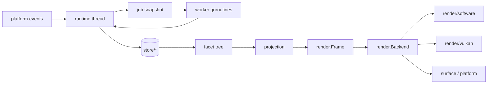
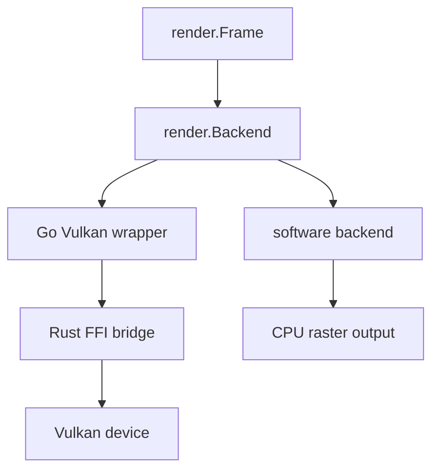
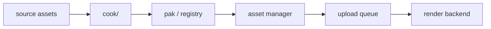
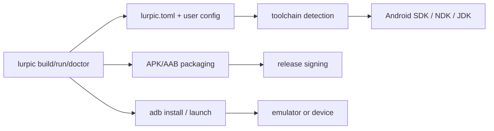

# Architecture

This is the current engine architecture reference for lurpicUI. It summarizes
the verified runtime path:

- `facet/` defines the projection tree and role model.
- `store/` owns shared mutable truth.
- `job/` carries snapshot → work → commit concurrency.
- `projection/` turns state into frame-ready structures.
- `render/` defines backend-agnostic frame and surface types.
- `render/software/` and `render/vulkan/` provide the concrete backends.
- `assets/` manages cooking, residency, and upload flow.

The architecture is constrained by the principles in
[Principles/LurpicUI-FacetRuntime-Principles.md](Principles/LurpicUI-FacetRuntime-Principles.md).

## At A Glance

## Core Ownership

### Facet tree

`facet/` defines the retained tree used by the runtime. The package synopsis in
[`facet/doc.go`](../facet/doc.go) describes it as the
base projection tree model for lurpicUI.

Facets are projection boundaries, not domain stores. The principle doc states
that facets own translation and local interaction state, while the actual domain
truth lives in stores.

### Stores

`store/` owns shared observable state. The principles document says stores are
the single source of truth, are mutated only on the runtime thread, and carry
monotonic versions so jobs can validate stale work before commit.

### Jobs

`job/` implements structured concurrency as snapshot → work → commit. The job
package synopsis calls this out directly, and Principle 5 describes the same
three-step contract. Workers never touch live state.

### Runtime

[`runtime/doc.go`](../runtime/doc.go) says the runtime
drives the facet tree through layout, projection, input, jobs, and rendering.
The principle doc gives the full 10-phase order:

1. Drain job results
2. Collect platform events
3. Tick hover
4. Tick active facets
5. Deliver input events
6. Deliver signals
7. Run layout
8. Run projection
9. Assemble render frame
10. Submit to render thread

That order is fixed. Invalidations accumulate until the layout and projection
phases run.

## Rendering

[`render/doc.go`](../render/doc.go) defines the backend
interfaces. `render.Backend` is the seam between runtime output and concrete
renderers.

Two concrete backends exist today:

- `render/software/` is the pure-Go fallback and is the default CPU-side path.
- `render/vulkan/` is the Rust-backed Vulkan bridge, with platform-specific
  FFI entry points and a build-tagged unavailable stub.

The root `render` package also exposes texture upload hooks so the Vulkan bridge
can provide upload/free behavior without creating an import cycle.

## Assets

`assets/` covers the cook/runtime asset pipeline:

- `assets/cook/` turns source images into KTX2 LODs.
- `assets/pak.go` and related files define the packed asset format and loading
  path.
- `assets/upload.go` defines the queue contract between the asset manager and
  render backends.

The current code path uses the backend's preferred texture format and a
per-frame upload budget for residency decisions.

## Android Build Topology

`cmd/lurpic/` is the developer-facing Android build and run tool. The verified
flow is:

The relevant implementation entry points are:

- [`cmd/lurpic/main.go`](../cmd/lurpic/main.go)
- [`cmd/lurpic/config.go`](../cmd/lurpic/config.go)
- [`cmd/lurpic/toolchain.go`](../cmd/lurpic/toolchain.go)
- [`cmd/lurpic/android_builder.go`](../cmd/lurpic/android_builder.go)
- [`cmd/lurpic/run.go`](../cmd/lurpic/run.go)

## Current Scope

This document describes the engine path that is verified today:

- facet tree and role model
- store-driven state ownership
- job-based background work
- software and Vulkan render backends
- the asset cook/upload path
- Android build and run topology

It does not attempt to define future architecture or the still-stabilizing
marks API surface.
